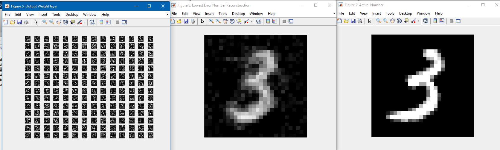
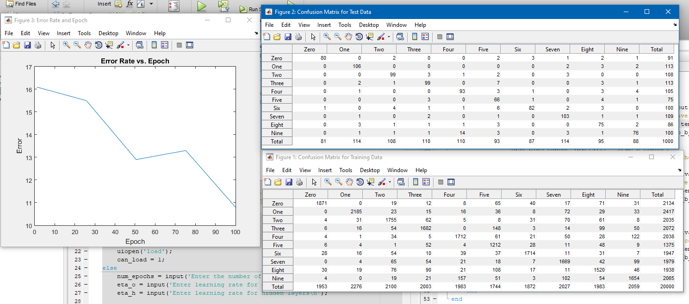

# ANN

This is some code I wrote for developing a neural network from scratch. Any external references are listed in the comments.

Disclaimer: this code is really bad? This is code from my first (and only--so far) implementation of a neural network from scratch. 
I hadn't used any machine learning libraries prior to making this, so it is clear I had no idea how to make this intuitive. I 
don't have the time to go back and make the functions work beter (like creating a network object and such). The big takeaway is 
that the top level contains three applications:

ANN.m is a really primitive neural-network builder. It relies on user inputs and doesn't provide much flexibility (the user inputs 
desired number of neurons and number of layers--making this very inflexible). 

Autoencoder.m uses network data and shared functions in ANN.m. It outputs a bunch of data, but the most interesting portion is the 
plots of all the weights--you should be able to see what features light up certain neurons

Autoencoder_ANN.m is lacking a bit... Tries to implement the dropout regularization to make more interesting plots, but I don't think 
I've ever been satisfied with the results.

Hopefully this helps anyone trying to learn how to make a neural network from scratch in MATLAB

In ANN/data I included a .mat file that can be loaded into the autoencoder, but the idea is to run all of these in this order:
1. ANN.m, save results
2. Autoencoder.m, load results from 1, save new results
3. Autoencoder_ANN.m, load results from 2

